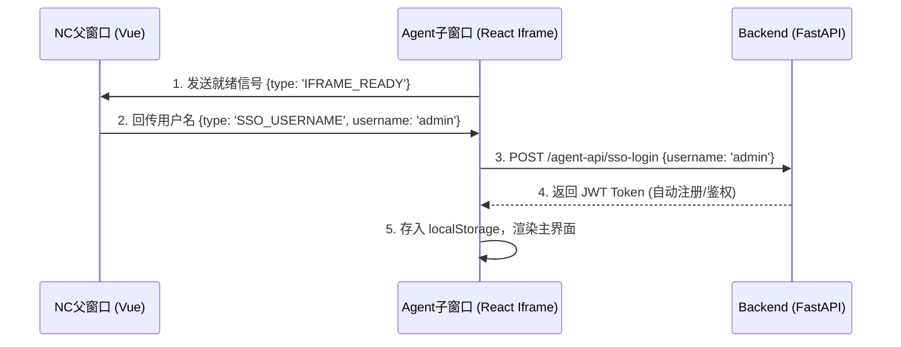
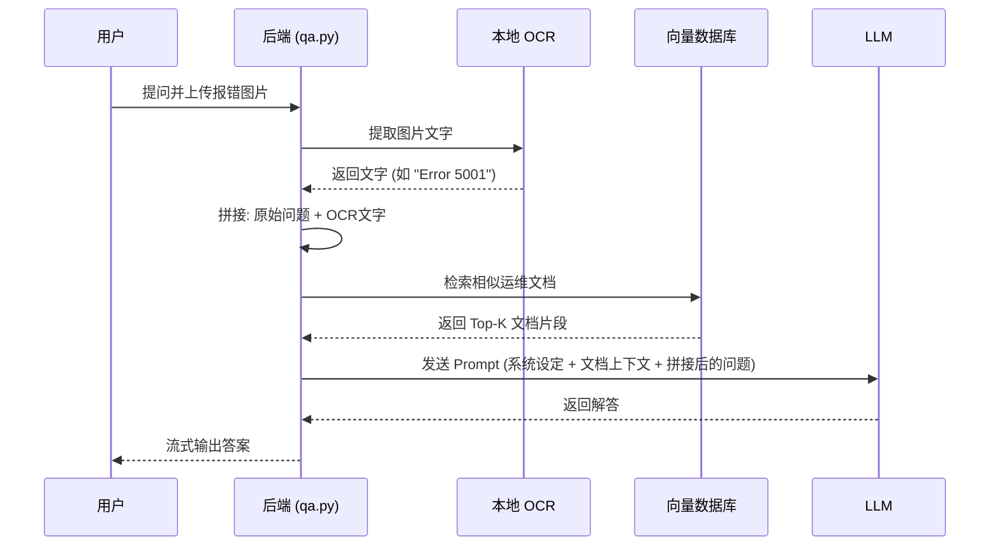

# 运维智能助手 (Ops Agent) 开发者指南

## 1. 项目背景与目标
本项目旨在为企业内网的 NC (Network Center) 框架提供一个智能化的运维问答助手。通过嵌入到现有的运维门户中，用户可以通过自然语言提问、上传报错截图，快速获取标准的操作指南和故障排查建议。
**核心目标**：
*   实现多模态（文本+图片）的运维知识检索。
*   无缝嵌入现有 NC 前端框架（SSO单点登录、Iframe跨域通信）。
*   提供纯本地化、高度可移植的后端部署包，适应老旧的内网服务器环境（如 BCLinux 8.2）。

---

## 2. 系统架构图与模块划分

系统采用前后端分离，前端通过 Iframe 嵌入到主系统中。

### 2.1 架构简图
```text
[ 浏览器 (NC 门户) ]
       │
       ├─(postMessage SSO 握手)─┐
       │                        │
[ Nginx (代理与 CSP 白名单) ] <─┘
       │
       ├─ /m/demo/ (NC Shell 静态资源)
       ├─ /m/demo/agent-ui/ (React 助手界面)
       └─ /agent-api/ (转发至后端)
               │
      [ FastAPI (Ops Agent 后端) ]
               ├── auth.py (鉴权与 SSO)
               ├── rag/qa.py (RAG 核心逻辑)
               ├── ocr_engine.py (RapidOCR 图片识别)
               ├── llm/ (大模型接入工厂)
               └── db.py (PostgreSQL 连接)
                       │
             [ PostgreSQL (包含 pgvector 插件) ]
```

### 2.2 核心模块
*   **前端 (React)**: 负责聊天交互、文件上传、Markdown 渲染、SSO 握手。
*   **后端 (FastAPI)**: 
    *   **鉴权模块**: 处理 JWT Token 和 JIT (Just-In-Time) 用户自动创建。
    *   **RAG 模块**: 负责文档的向量化、检索、Prompt 组装。
    *   **OCR 模块**: 使用 `rapidocr-onnxruntime` 进行纯本地图片文字提取。
    *   **LLM 工厂**: 统一封装 OpenAI 格式接口，支持硅基流动、Ollama、vLLM 等。

---

## 3. 技术栈与依赖说明

### 前端
*   框架: React 18 + Vite
*   路由: React Router (HashRouter，避免与 NC 框架路径冲突)
*   样式: Tailwind CSS + Lucide React (图标)

### 后端
*   核心框架: FastAPI (Python 3.9)
*   数据库: PostgreSQL + `pgvector` 扩展
*   ORM: SQLAlchemy 2.0
*   大模型 SDK: `openai`, `zhipuai`
*   OCR 引擎: `rapidocr-onnxruntime` (无 GUI 依赖，适配服务器)
*   打包工具: PyInstaller (单文件二进制打包)

---

## 4. 环境搭建步骤

### 4.1 开发环境 (外网)
1.  **数据库**: 启动包含 pgvector 的 PostgreSQL 容器。
    ```bash
    docker run -d --name pgvector -p 5432:5432 -e POSTGRES_USER=ops_user -e POSTGRES_PASSWORD=ops_password -e POSTGRES_DB=ops_agent pgvector/pgvector:pg16
    ```
2.  **后端**:
    ```bash
    cd backend
    python -m venv venv
    source venv/bin/activate
    pip install -r requirements.txt
    cp config.yaml.example config.yaml # 配置 LLM API Key
    uvicorn main:app --reload --port 9020
    ```
3.  **前端**:
    ```bash
    cd frontend
    npm install
    npm run dev
    ```

### 4.2 生产环境 (内网)
生产环境采用一键打包脚本 `build_intranet.sh`，生成独立的二进制文件。
1.  **打包**: 在有外网的机器上执行 `./build_intranet.sh`。这会下载 Python 3.9 环境，安装所有依赖，并使用 PyInstaller 生成 `ops-agent-linux-x64.zip`。
2.  **部署**: 将 zip 包传入内网，解压后修改 `config.yaml` 中的数据库和内网大模型地址。
3.  **启动**: `chmod +x ops-agent && ./ops-agent`。

---

## 5. 核心功能流程图

### 5.1 SSO 自动登录流程 (Double Handshake)


### 5.2 带图片的智能问答流程


---

## 6. API 接口文档 (部分核心接口)

### 6.1 SSO 登录
*   **路径**: `/sso-login`
*   **方法**: `POST`
*   **描述**: 接收前端传来的用户名，进行 JIT (Just-In-Time) 注册并下发 Token。
*   **请求体**:
    ```json
    { "username": "string" }
    ```
*   **响应体**:
    ```json
    {
      "access_token": "eyJhbG...",
      "token_type": "bearer",
      "role": "admin|user",
      "username": "string"
    }
    ```

### 6.2 获取回答 (RAG 核心)
*   **路径**: `/get_answer`
*   **方法**: `POST`
*   **请求头**: `Authorization: Bearer <token>`
*   **请求体**:
    ```json
    {
      "question": "如何处理OOM报错？",
      "image": "data:image/png;base64,..." // 可选
    }
    ```
*   **响应体**:
    ```json
    {
      "answer": "根据《运维手册》，请先检查...",
      "sources": [{"id": 1, "filename": "运维手册.docx", "score": 1.2}],
      "question_id": 123
    }
    ```

---

## 7. 数据库设计

系统在启动时会自动初始化表结构。

### 7.1 表结构说明
1.  **`documents` (向量表)**: 存储切分后的文档及 `vector(1024)` 向量，用于相似度检索。
2.  **`users`**: 存储本地用户和 SSO 同步用户的账号及角色（admin/user/guest）。
3.  **`admin_whitelist`**: SSO 登录时的管理员白名单。在此表中的用户自动赋予 admin 角色。
4.  **`chat_logs`**: 存储用户的历史问答、上传的图片路径及模型的回答。
5.  **`learned_qa`**: 知识进化库。存储人工审核通过的 Q&A，会被高优检索。
6.  **`uploaded_files`**: 记录用户上传的原始文件，用于后台审核和下载。

### 7.2 核心索引策略
*   `documents` 表的 `embedding` 字段依赖 `pgvector` 扩展，通过余弦相似度或 L2 距离进行 KNN 检索。

---

## 8. 代码规范与目录结构

```text
agent-nca/
├── backend/                  # Python 后端
│   ├── auth.py               # 鉴权逻辑 (JWT, SSO)
│   ├── db.py                 # 数据库连接
│   ├── main.py               # FastAPI 路由与入口
│   ├── ocr_engine.py         # RapidOCR 封装引擎
│   ├── llm/                  # 大模型调用封装 (工厂模式)
│   └── rag/                  # 检索增强生成模块 (loader, retriever, qa)
├── frontend/                 # React 前端
│   ├── src/
│   │   ├── components/       # UI 组件 (Chat, Sidebar等)
│   │   ├── App.jsx           # 根组件 (含 SSO 握手逻辑)
│   │   └── ...
├── build_intranet.sh         # 内网单文件打包脚本 (核心)
├── config.yaml               # 部署配置文件
└── README.md
```
**规范建议**: 
*   新增依赖需严格评估是否能在离线 Linux 环境下通过 wheel 包安装（警惕 C++ 编译依赖）。
*   后端添加新 API 需在 `main.py` 注册，并添加权限控制 `Depends(get_current_active_user)`。

---

## 9. 部署发布流程

1.  **构建**: 运行 `./build_intranet.sh`。脚本会下载独立的 Python 3.9，安装 `opencv-python-headless` 和 `rapidocr`，最后打包成 `ops-agent-linux-x64.zip`。
2.  **配置**: 在内网服务器解压包，编辑 `config.yaml`，填入内网数据库信息和 LLM 接口地址。
3.  **Nginx 代理**: 修改内网 Nginx 配置，添加 CSP 白名单允许 Iframe 嵌套，并将 `/agent-api/` 反向代理到二进制程序运行的端口（如 9020）。
4.  **启动**: `./ops-agent`。

---

## 10. 常见问题排查指南 (Troubleshooting)

*   **Q: Nginx 部署后页面显示空白或报错 `Cannot find module`**
    *   **排查**: 检查前端打包文件的部署路径是否与 Nginx 中 `alias` 配置严格一致（如 `/m/demo/`）。检查 Nginx 的 `try_files` 配置是否正确。
*   **Q: Iframe 嵌套被浏览器拦截 (Refused to frame)**
    *   **排查**: 检查 Nginx 的响应头。必须移除 `X-Frame-Options SAMEORIGIN`，并正确配置 `Content-Security-Policy: frame-ancestors 'self' <父级域名>`。
*   **Q: 内网启动报错 `libxcb.so.1: cannot open shared object file`**
    *   **排查**: 说明打包环境错误地引入了带 GUI 的 OpenCV。确保 `build_intranet.sh` 中安装的是 `opencv-python-headless`。
*   **Q: 图片提问报错 422 Model not found**
    *   **排查**: 确保 `qa.py` 中在 OCR 提取成功后，将 `image` 参数置为了 `None`，防止系统去请求不存在的多模态模型。

---

## 11. 性能优化与安全建议

*   **性能优化**:
    *   **数据库**: 当 `documents` 表数据量达到万级时，应为 `embedding` 字段建立 HNSW 或 IVFFlat 索引以加速检索。
    *   **OCR**: 目前使用 CPU 进行推理。如果服务器支持，可替换为 ONNX 的 GPU 运行时。
*   **安全注意**:
    *   生产环境的 `config.yaml` 中的数据库密码切勿提交到代码仓库。
    *   上传文件接口 `/upload_doc` 应严格限制文件大小和类型，防止恶意文件上传。

---

## 12. 示例代码片段：如何添加一个新的 LLM 供应商

在 `backend/llm/factory.py` 中：

```python
from .openai_client import OpenAIClient

def get_llm_client(model: str = None):
    provider = os.getenv("LLM_PROVIDER", "siliconflow").lower()
    
    # 假设新增了一个名为 'my_internal_llm' 的内网模型
    if provider == "my_internal_llm":
        base_url = os.getenv("LLM_BASE_URL", "http://internal-api/v1")
        api_key = os.getenv("LLM_API_KEY", "dummy")
        default_model = os.getenv("LLM_MODEL", "internal-model-v1")
        # 如果内网模型兼容 OpenAI 接口格式，可直接复用 OpenAIClient
        return OpenAIClient(api_key, base_url, model or default_model)
        
    # ... 其他 provider 逻辑 ...
```
